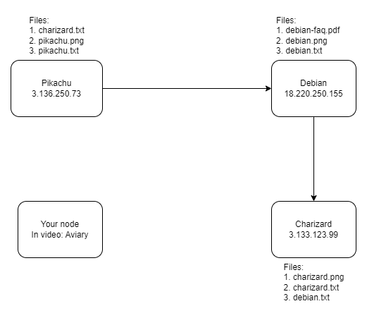

# Gnutella-compliant client

A Gnutella-compliant client is a software application that follows the Gnutella protocol, a peer-to-peer file sharing protocol used to search for and exchange files over the Internet.
It enables users to search for files on the Gnutella network, which is a decentralized network where users connect directly to each other to share files. This means that there is no central server controlling the network, and users are free to share any type of file they choose

## Requirements

- Python 3

## Project file distribution
1. Downloads (Folder): This folder is used to store the files download using th Gnutella client.
2. Share (Folder): In this folder, you can keep the files which you want to share with other nodes on the network.
3. client.py: This is the main python file used to run the Gnutella client.
4. Documentation: contains README.md related files

### Ports used

- 6346: For connection purposes (all are TCP connections)
- 60000: For sending and receiving messages and files (TCP)
- 60001: The client sends the log output using UDP to this port on localhost, if you want to see the log details, you can listen on this port.

## How to run the client and helpful commands

To run the client, oepn a terminal, go to the directory where the Gnutella client files (above file distribution) is located. 

`cd \path\to\the\directory`

Use the following command to the run the client :

`python3 client.py`

After running the client , you can type '`help`' to get a list of useful commands which are as follows:

```
Commands:
connect [host] [port] - Connect to a node in the Gnutella network
disconnect [connection number] - Disconnect from the specified connection or all connections, you can get the connection number by using the list command
list - List all current connections
search [query] - Search for files on the Gnutella network and then download it
help - Show this help message
quit - Quit the client
```

 
## Provide Network design 

I was not able to find a suitable network to show the working of the client. So, I created a small network using a bunch of nodes containing files to test the network. The following image showa the designs, and the files associated with each node.



In the image, your node can be connected to any node and it should be able to access the files on any other node in the network. You can add more nodes to expand the network. This network was tested on Aviary.
IMPORTANT: This network is going to be active till May 10, 2023 

## Troubleshooting

- Sometime's the program is not able to get the host's ip address correctly, try to switch to a system such as Aviary, where it's easier to detect the public ip of user.

## More resources
 
 - https://docs.python.org/3/
 - https://en.wikipedia.org/wiki/Gnutella
 - https://www.gnutellaforums.com/

 ## Contributors

 - Sahilpreet Singh Sidhu (only 1 member): sidhuss3@myumanitoba.ca

## Github

https://github.com/ssxsidhu/gnutella-client
